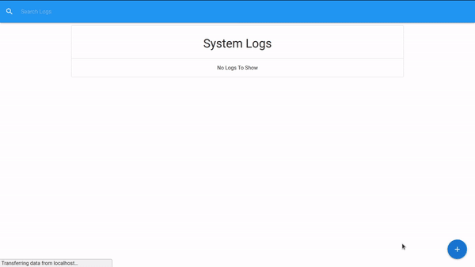

# IT Logger



## What is This Project About

Logger Themed for an It Department, This project was developed during the course [React Front To Back](https://www.udemy.com/course/modern-react-front-to-back). It's an application developed with React using React Hooks, Redux and the Back End with [Json Server](https://github.com/typicode/json-server).

## How To Setup The Project

1. Enter in the desired project directory

2. Clone the repository

    ```bash
      git clone https://github.com/ThiagoNunesBatista/it-logger.git
    ```

3. Enter in the project folder and install dependencies

    ```bash
    cd it-logger && npm install
    ```

4. Start the project

    ```bash
    npm run dev
    ```

## LICENSE

This project is Open Source and is licensed under [MIT license](https://github.com/ThiagoNunesBatista/it-logger/blob/master/LICENSE). Feel free to do whatever you want with this code. If you want to contribute to this code, issues and pull requests are very welcome.
